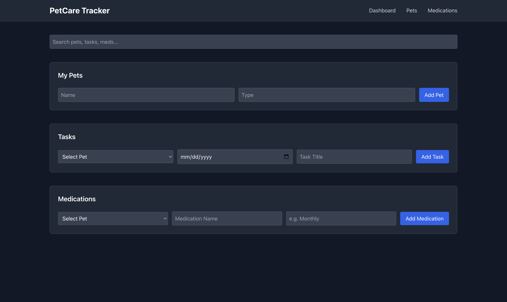

# PetCare Tracker

A Vue 3 + Vite single‑page app for managing your pets, their medications, and scheduled tasks—with rich recurrence rules, inline editing, and a dark/light theme.

---

## 📸 Demo



---

## 🚀 Features

- **Pet Management**  
  - Add, edit (inline), and delete pets  
  - Live‑updating list stored in Pinia

- **Medication Tracking**  
  - Add, edit (inline), and delete medications per pet  
  - Schedule strings (e.g. “Monthly”) for upcoming doses

- **Task Scheduling & Recurrence**  
  - Add tasks with a built‑in form  


- **Inline Editing & History**  
  - Click “Edit” on any pet, task or medication to modify in place  
  - Mark tasks complete and view a “History” archive with timestamps (powered by Day.js)

- **Dark / Light Theme**  
  - Toggle between light and dark modes; preference saved in `localStorage`  
  - Tailwind’s `dark:` variants for seamless theming

---

## 🛠️ Tech Stack

- **Framework:** Vue 3  
- **Build Tool:** Vite  
- **State Management:** Pinia  
- **Styling:** Tailwind CSS (JIT + dark mode)  
- **Date Formatting:** dayjs  
- **HTTP:** Axios  

---

## 🚧 Installation & Development

1. **Clone the repo**  
   ```bash
   git clone https://github.com/mariousy/petcare-tracker.git
   cd petcare-tracker
   ```

2. **Install dependencies**  
   ```bash
   npm install
   ```

3. **Configure your API**  
   By default the app calls `/api/pets`, `/api/tasks`, and `/api/medications`.  
   You can run a JSON Server for a quick mock backend:
   ```bash
   npm install -g json-server
   json-server --watch db.json --port 3000
   ```
   Then add a `vite.config.js` proxy:
   ```js
   // vite.config.js
   export default {
     server: {
       proxy: {
         '/api': 'http://localhost:3000'
       }
     }
   }
   ```

4. **Run the dev server**  
   ```bash
   npm run dev
   ```
   Open <http://localhost:5173> to view.

5. **Build for production**  
   ```bash
   npm run build
   ```

---

## 📄 Project Structure

```
petcare-tracker/
├─ src/
│  ├─ components/
│  │  ├─ PetList.vue
│  │  ├─ MedicationForm.vue
│  │  ├─ TaskCalendar.vue
│  │  └─ RecurrencePicker.vue
│  ├─ store/
│  │  ├─ pets.js
│  │  ├─ medications.js
│  │  └─ tasks.js
│  ├─ views/
│  │  └─ Dashboard.vue
│  ├─ App.vue
│  └─ main.js
├─ public/
│  └─ index.html
├─ tailwind.config.cjs
├─ vite.config.js
└─ README.md
```

---

## 🤝 Contributing

1. Fork the repo  
2. Create a feature branch (`git checkout -b feature/my-feature`)  
3. Commit your changes (`git commit -m "Add awesome feature"`)  
4. Push to the branch (`git push origin feature/my-feature`)  
5. Open a Pull Request

---

## 📝 License

This project is licensed under the [MIT License](LICENSE).
